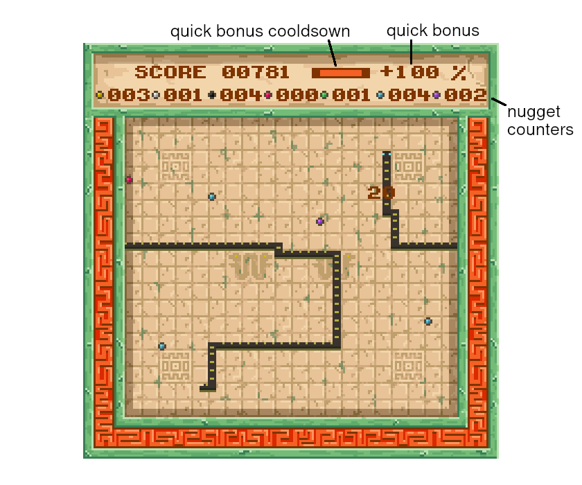
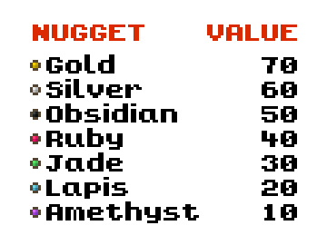

  

## What's this?

Itcoatl is an Aztec themed version of the game Snake :snake: made to test drive my engine Pixiretro. It features a main menu and a high scorer's leaderboard as well as the game itself. The gameplay consists of eating as many nuggets as you can as quickly as you can, gaining score bonuses for speed and nugget combos.

The game also features 8 playable snakes: Itzcoatl, Montezuma I, Axayacatl, Tizoc, Ahuitzotl, Montezuma II, Cuitlahuac and Cuauhtemoc named after the 8 Aztec emperors, just like the name of the game itself. Itzcoatl. The first emperor of the Aztec triple alliance. Which according to a webpage titled "122 fabulous Aztec baby names with meanings" (a highly reputable source :stuck_out_tongue_winking_eye:) means "Obsidean Serpent", which I felt was most fitting. So how do you pronounce any of these names? ... no idea! Please consult your local Aztecologist. I do know how to pronounce Montezuma though, its mont-ee-zooma ... thanks CIV! :grinning:

## The Menu

## How to Play 🕹️:joystick:

As is standard with Snake games the more you eat the more grow. This makes the game harder over time. What differs with Itzcoatl however is that mister snake resides in a world abundant with GOLD! :money_bag: Among other assorted valuables. The challenge is to max out your score before you grow so long and hungry that you inevitably eat yourself. 

The world contains 7 possible edible nuggets, in order of value: Gold, Silver, Obsidian, Ruby, Jade, Lapis, and Amethyst. You earn their value when you eat them. If you eat them with haste you earn speed bonuses, and if you eat them in particular orders you earn combo bonuses. But no matter what nugget you eat when, mister snake grows with every bite. To maximise score you need to be fussy with what you eat whilst also eating fast. You only get so many bites before mister snake gets really long! And the temptation to eat youself really hard to resist!

As is standard with snake games you play as a snake which must eat as many nuggets as possible whilst growing in length with each nugget eaten. In this version the snake does not collide with the world edges opting instead to wrap around to the other side as shown in the screenshot below. The only obstacle in the game is thus yourself with a single bite of your own body resulting in immediete game over.

  

There are 7 varieties of nugget to eat in the game with each nugget having a unique score value as shown in the table below. Scores can be multiplied by eating nuggets in quick succession or by eating x3 of a single nugget type in sequence. The quick succession bonus increases with longer chains of quick eats. Eating a single nugget and then a second nugget before the quick bonus cooldown will boost the quick bonus to +10% giving an extra 10% to all future nuggets eaten. Continuing to eat nuggets before the quick cooldown will rack up the quick bonus up to a max of 250%. However if the cooldown drops to zero you lose all accumulated quick bonus and have to build it back up.

The two types of bonuses can be combined too, so if you have a current quick bonus of +250% and then eat x3 of a single nugget type in sequence the +250% applies to the combo bonus too.

  

## Controls

## Compilation

## Credits
