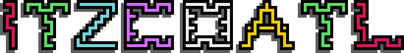
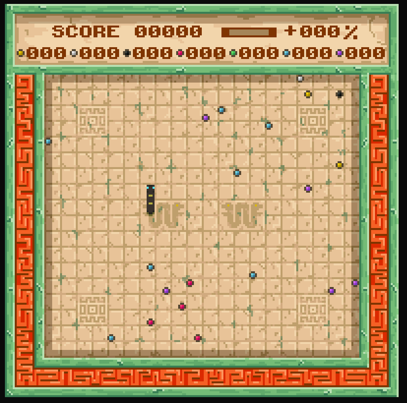
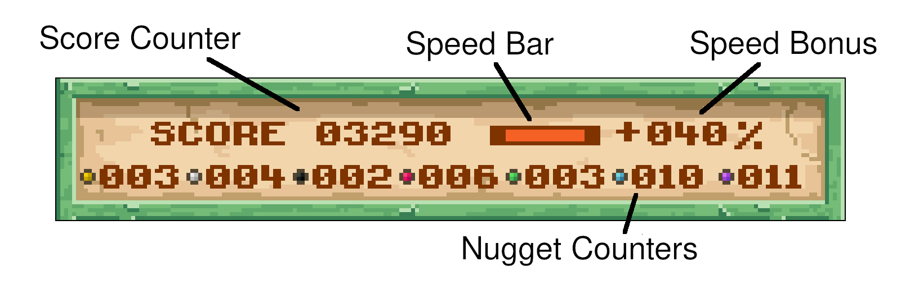
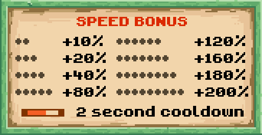
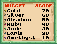
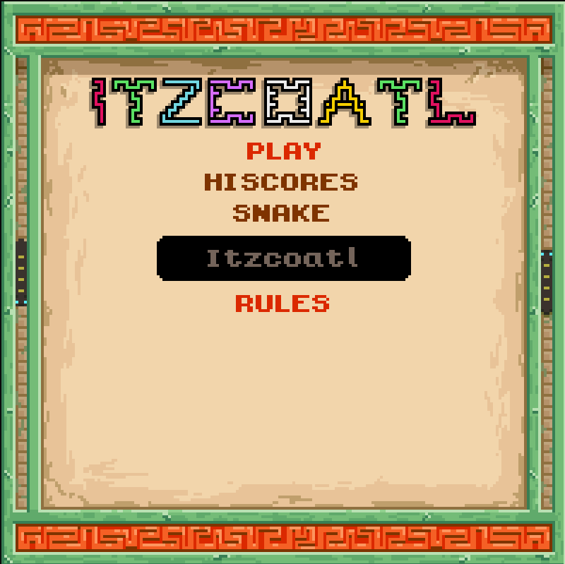

<p align="center">
  
</p>

## What's this?


[](/todo)

Itzcoatl is an Aztec themed version of the game Snake :snake: made to test drive my game engine Pixiretro. It features a main menu and a high scorer's leaderboard as well as the game itself. The gameplay consists of eating as many nuggets as you can as quickly as you can, gaining score bonuses for speed and nugget combos.

The game also features 8 playable snakes: Itzcoatl, Montezuma I, Axayacatl, Tizoc, Ahuitzotl, Montezuma II, Cuitlahuac and Cuauhtemoc :sweat_smile: named after the 8 Aztec emperors, just like the name of the game itself. Itzcoatl. The first emperor of the Aztec triple alliance. Which according to a webpage titled "122 fabulous Aztec baby names with meanings" (a highly reputable source :stuck_out_tongue_winking_eye:) means "Obsidian Serpent", which I felt was most fitting. So how do you pronounce any of these names? ... no idea! Please consult your local Aztecologist :stuck_out_tongue_closed_eyes:. I do know how to pronounce Montezuma though, its mont-ee-zooma ... thanks CIV! :grinning:

## How to Play :joystick:

As is standard with Snake games the more you eat the more you grow. This makes the game harder over time. What differs with Itzcoatl however is that mister snake resides in a world abundant with GOLD! :moneybag: Among other assorted valuables. The challenge is to max out your score before you grow so long and so hungry that you inevitably eat yourself! :scream: Oh, the humanity!

The world contains 7 possible edible nuggets, in order of value: Gold, Silver, Obsidian, Ruby, Jade, Lapis, and Amethyst. You earn their value when you eat them. If you eat them with haste you earn speed bonuses, and if you eat them in particular orders you earn combo bonuses. But no matter what nugget you eat when, mister snake grows with every bite. To maximise score you need to be fussy with what you eat whilst also eating fast. You only get so many bites before mister snake gets really long! And the temptation to eat youself really hard to resist!

<p align="center">
  
</p>

### Eat Fast! Eat Smart! :nerd_face:

Every time you bite a nugget, the speed timer is reset. Bite another before the timer expires and you earn a speed bonus. Bite more and your speed bonus racks up, and up and up to a max of +200% score, on top of the base value, for every nugget munched. But miss just a single speedy bite and your bonus drops all the way back to zilch. So you will want to keep a keen eye on the speed bar! You can find the speed bar on the HUD, along with your current speed bonus.

<p align="center">
  
</p>

The speed table below shows all the speed bonuses you can earn. The +20% bonus, for example, is earned by eating a nugget, then another before the speed timer expires, and then another again before the speed timer expires.

<p align="center">
  
</p>

Eating smart means thinking nugget combos. There are 3 types of combo you can earn:
1. Eat x3-5 of the same nugget, followed by a different nugget, and earn x3 of the different nuggets value.
2. Eat x6 of the same nugget, and earn x6 of that nuggets value.
3. Eat all nugget types in order of ascending value and earn x9 of the final nugget's value. The GOLD! nugget :moneybag:. A whopping 630 points! :money_mouth_face:

<p align="center">
  
</p>

As a bonus (pun intended) the bonuses combine too, so if your speed bonus is maxed out at +200% and you eat one of each nugget type in order of value, that sweet gold bonus becomes 2010 points! :astonished::money_mouth_face::money_mouth_face: Is this broken! Who knows!? :upside_down_face:

## Menu

From the main menu you can select which snake you want to play as, view the high scores table and start up a game. Your chosen emperor can be seen slivering up and down the sides. :snake: A cylcing display also explains the game rules and details of the score bonuses you can earn.

<p align="center">
  
</p>

## Controls

The controls are super simple. Use the arrow keys to steer mister snake in any which way you please, and the enter key, when on the menu, to select an option.

Don't like these controls? :anguished: You can change them with a small edit to snake.h; all controls are laid out in the controls configuration section of the header starting line 86.

```c++
////////////////////////////////////////////////////////////////////////////
// CONTROLS       
////////////////////////////////////////////////////////////////////////////

static constexpr pxr::input::KeyCode moveLeftKey  {pxr::input::KEY_LEFT  };
static constexpr pxr::input::KeyCode moveRightKey {pxr::input::KEY_RIGHT };
static constexpr pxr::input::KeyCode moveUpKey    {pxr::input::KEY_UP    };
static constexpr pxr::input::KeyCode moveDownKey  {pxr::input::KEY_DOWN  };

static constexpr pxr::input::KeyCode smoothToggle {pxr::input::KEY_s     };

static constexpr pxr::input::KeyCode menuUpKey    {pxr::input::KEY_UP   };
static constexpr pxr::input::KeyCode menuDownKey  {pxr::input::KEY_DOWN };
static constexpr pxr::input::KeyCode menuPressKey {pxr::input::KEY_ENTER};
```
The key codes are in source/pixiretro/pxr_input.h. But you can pretty much guess them; all lowercase alpha characters are simply KEY_<lowercase_letter>. Which is likely all you will want to know if you are seeking a WASD play setup.

Whats the smooth toggle you may be wondering? :confused: It switches between an alternative drawing mode for the snake which makes the snake move smoother, at the cost of less pretty animations. I couldn't quite decide which mode I like best so I set the pretty animations to the default and added the toggle option. You can decide for yourself which you prefer. :thumbsup:

## Compilation

The engine has dependencies on SDL2, SDL2_mixer, and an opengl implementation such as mesa. I have only tested the game on Arch and Ubuntu so I do not know if it will compile on other distros. I have used some C++17 features in the code too so you will need a compiler that supports modern C++. On ubuntu the latest version of GCC availible in the official repos (as of the date of writing 17-04-2021) does not so you will have to use clang on ubuntu. On Arch you can use GCC. I have created seperate makefiles for each platform. You will need to rename the one you need before running make.

The full steps to compile are simply to clone this repo, install the dependencies with your package manager and run make with the makefile you need for your platform.

On Arch linux

```shell
$ pacman -S sdl2 sdl2_mixer mesa
$ make
```
and on Debian:

```shell
$ apt install libsdl2-2.0-0 libsdl2-dev libsdl2-mixer-2.0-0 libsdl2-mixer-dev libglx-mesa0
$ mv makefile makefile_arch
& mv makefile_ubuntu makefile
$ make
```
## Credits

All work is my own with the exception of the sound effects and music which are all from freesound.org. Attributions are listed below.

https://freesound.org/people/craigsmith/sounds/479553/
https://freesound.org/people/zagi2/sounds/194228/
https://freesound.org/people/zagi2/sounds/352715/
https://freesound.org/people/Mellau/sounds/506054/
