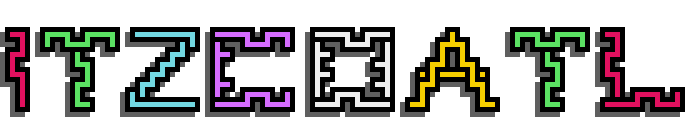
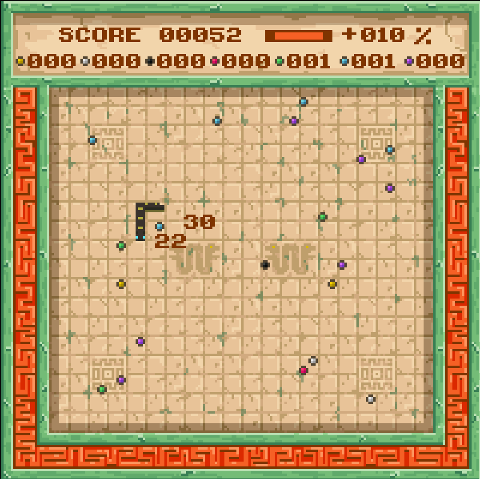
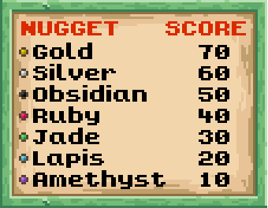

  

## What's this?

Itzcoatl is an Aztec themed version of the game Snake :snake: made to test drive my game engine Pixiretro. It features a main menu and a high scorer's leaderboard as well as the game itself. The gameplay consists of eating as many nuggets as you can as quickly as you can, gaining score bonuses for speed and nugget combos.

The game also features 8 playable snakes: Itzcoatl, Montezuma I, Axayacatl, Tizoc, Ahuitzotl, Montezuma II, Cuitlahuac and Cuauhtemoc :sweat_smile: named after the 8 Aztec emperors, just like the name of the game itself. Itzcoatl. The first emperor of the Aztec triple alliance. Which according to a webpage titled "122 fabulous Aztec baby names with meanings" (a highly reputable source :stuck_out_tongue_winking_eye:) means "Obsidian Serpent", which I felt was most fitting. So how do you pronounce any of these names? ... no idea! Please consult your local Aztecologist :stuck_out_tongue_closed_eyes:. I do know how to pronounce Montezuma though, its mont-ee-zooma ... thanks CIV! :grinning:

## How to Play :joystick:

As is standard with Snake games the more you eat the more grow. This makes the game harder over time. What differs with Itzcoatl however is that mister snake resides in a world abundant with GOLD! :moneybag: Among other assorted valuables. The challenge is to max out your score before you grow so long and hungry that you inevitably eat yourself. 

The world contains 7 possible edible nuggets, in order of value: Gold, Silver, Obsidian, Ruby, Jade, Lapis, and Amethyst. You earn their value when you eat them. If you eat them with haste you earn speed bonuses, and if you eat them in particular orders you earn combo bonuses. But no matter what nugget you eat when, mister snake grows with every bite. To maximise score you need to be fussy with what you eat whilst also eating fast. You only get so many bites before mister snake gets really long! And the temptation to eat youself really hard to resist!

  

### Eat Fast! Eat Smart! :thinking:

Every time you bite a nugget, the speed timer is reset. Bite another before the timer expires and you earn a speed bonus. Bite more and your speed bonus racks up, and up and up to a max of +200% score, on top of the base value, for every nugget munched. But miss just a single speedy bite and your bonus drops all the way back to zilch. So you will want to keep an keen eye on the speed bar! You can find the speed bar on the HUD, along with your current speed bonus.

  

The speed table shows all the speed bonuses you can earn. The +20% bonus, for example, is earned by eating a nugget, then another before the speed timer expires, and then another again before the speed timer expires.

  

Eating smart means thinking nugget combos. There are 3 types of combo you can earn:
1. Eat x3-5 of the same nugget, followed by a different nugget, and earn x3 of the different nuggets value.
2. Eat x6 of the same nugget, and earn x6 of that nuggets value.
3. Eat all nugget types in order of ascending value and earn x9 of the final nugget's value. The GOLD! nugget :moneybag:. A whopping 630 points! :money_mouth_face:

  

As a bonus (pun intended) the bonuses combine too, so if your speed bonus is maxed out at +200% and you eat one of each nugget type in order of value, that sweet gold bonus becomes 2010 points! :astonished::money_mouth_face::money_mouth_face: Is this broken! Who knows!? :upside_down_face:

  

## Controls

## Compilation

## Credits

All work is my own with the exception of the sound effects and music which are all from freesound.org. Attributions are listed below.

https://freesound.org/people/craigsmith/sounds/479553/
https://freesound.org/people/zagi2/sounds/194228/
https://freesound.org/people/zagi2/sounds/352715/
https://freesound.org/people/Mellau/sounds/506054/
